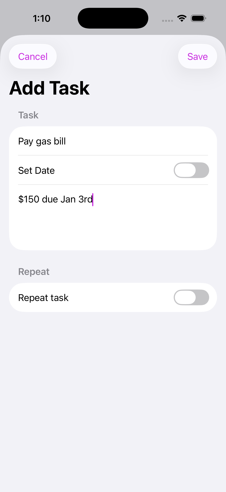
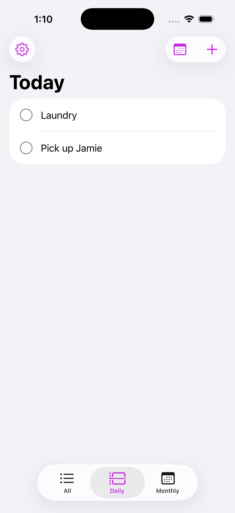
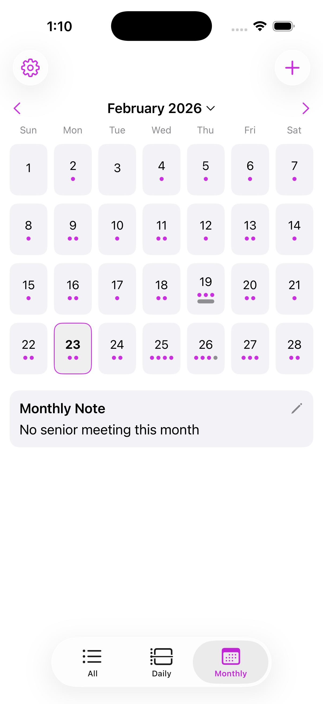
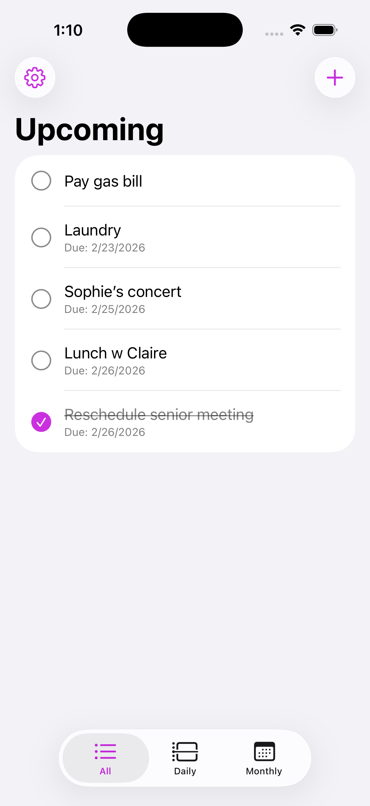
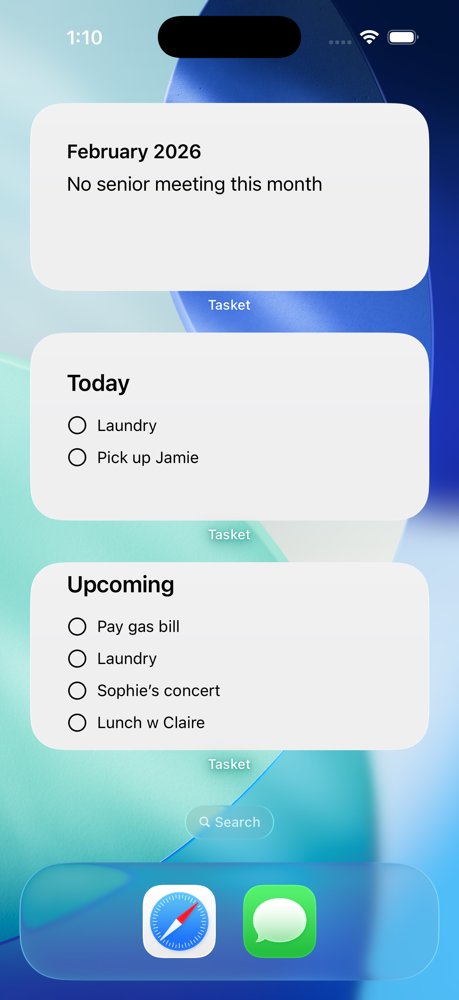
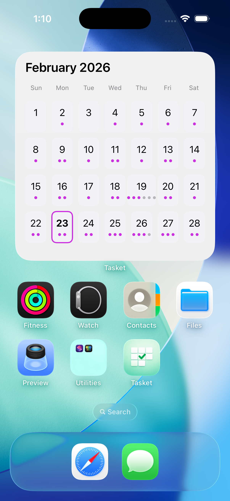
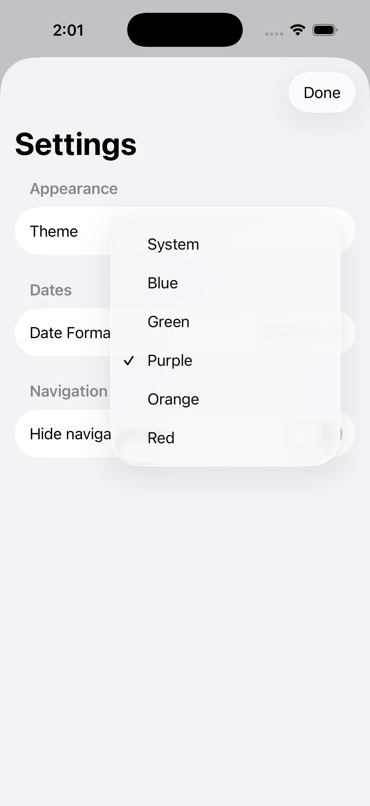

# Tasket

Tasket is a multi-platform task management app built with SwiftUI and SwiftData.

## Features
- Grid-based task layout
- Create, edit, delete tasks
- Task completion tracking
- Local persistence with SwiftData (iCloud in progress)
- Designed for iPhone (iPad, macOS, watchOS planned)

## Tech Stack
- Swift
- SwiftUI
- SwiftData
- Xcode

## Architecture
- SwiftUI declarative UI
- MV-style separation of model and view
- Local data persistence using SwiftData

## Demo
(Coming soon)

## Screenshots

  
  
  
  
  
  
  

